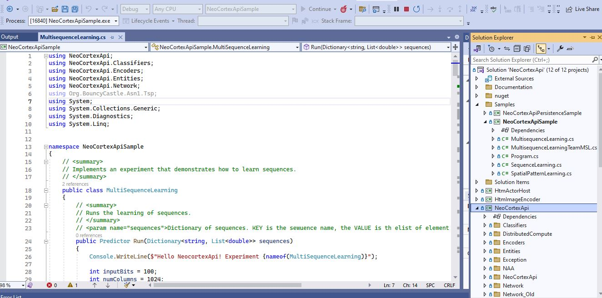
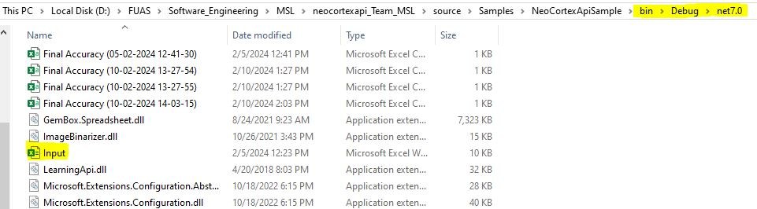
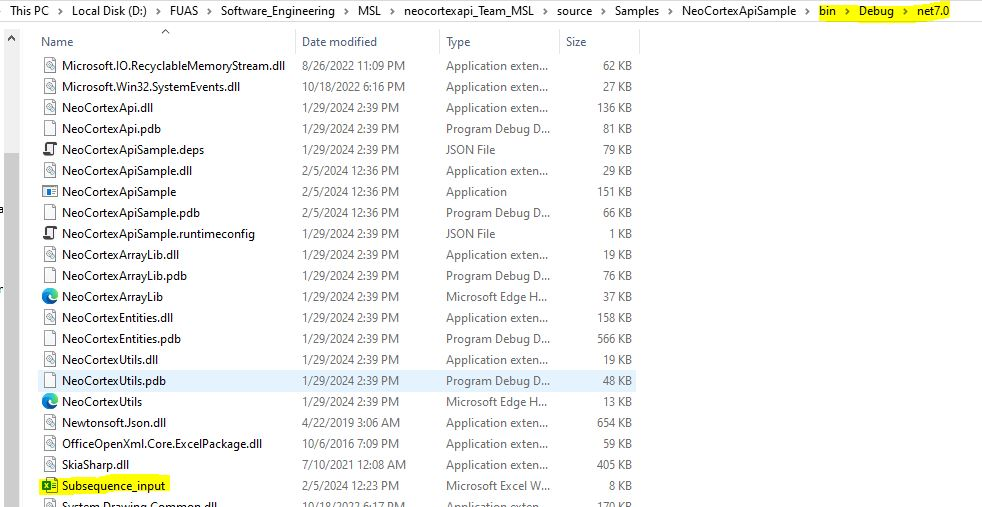
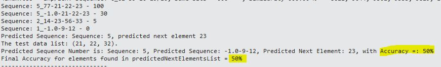
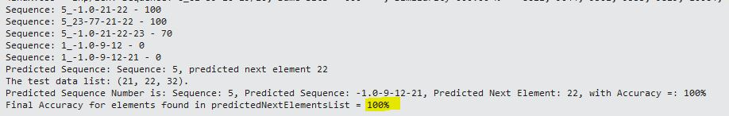

## How to run the project

Open the sln and select MultiSequenceLearningTeamMSL as startup project.

### To run the experiment:

Keep your Input.xlsx file and Subsequence_input.xlsx file in Environment.CurrentDirectory and run the project

### Results:

We have extensively tested to the greatest extent possible, using various datasets. To manage the substantial execution time, we intentionally restricted the dataset size and kept the sequences to a minimum length.

Reference Outputs:

